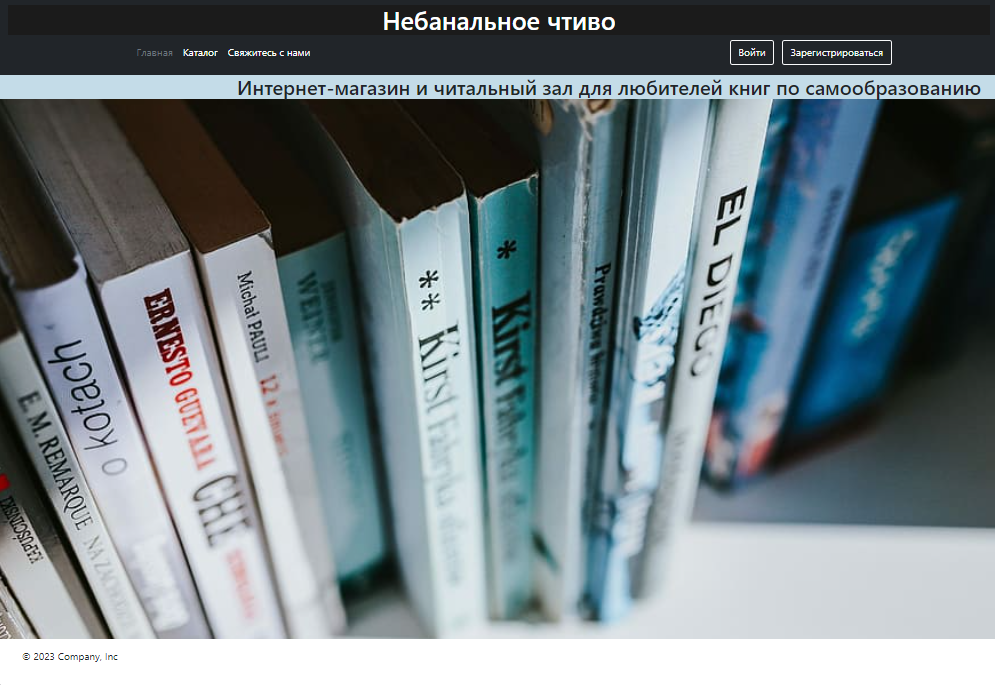
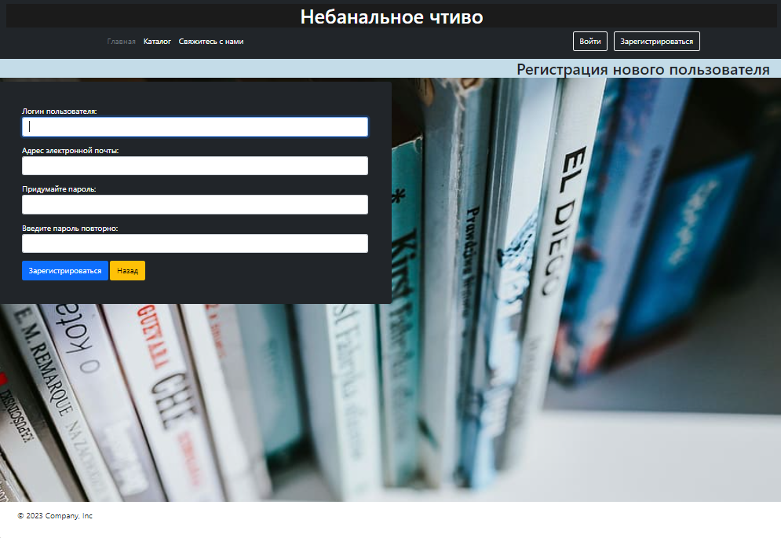
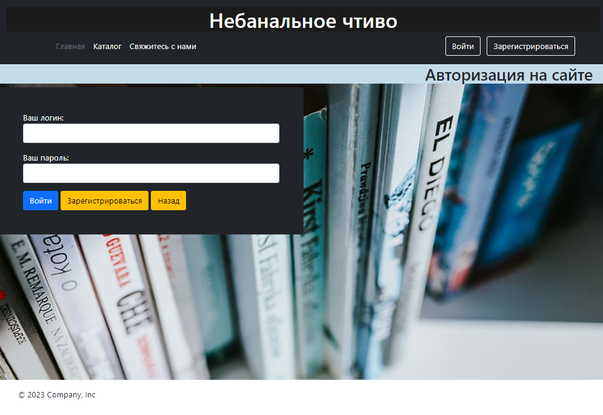
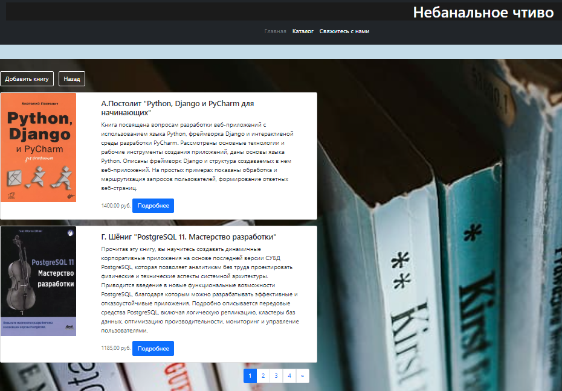
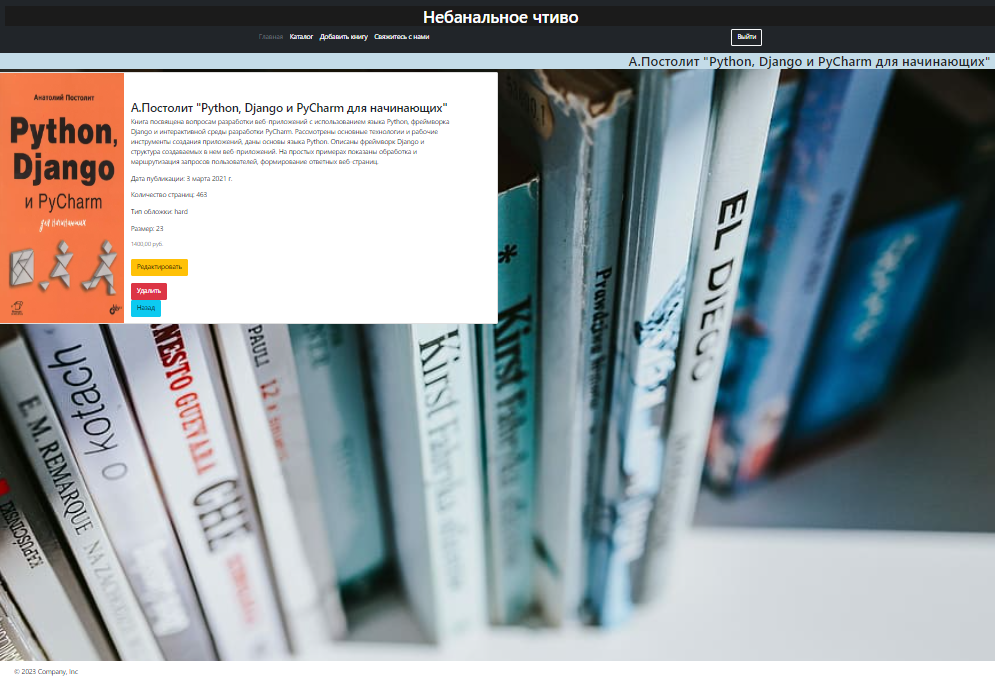
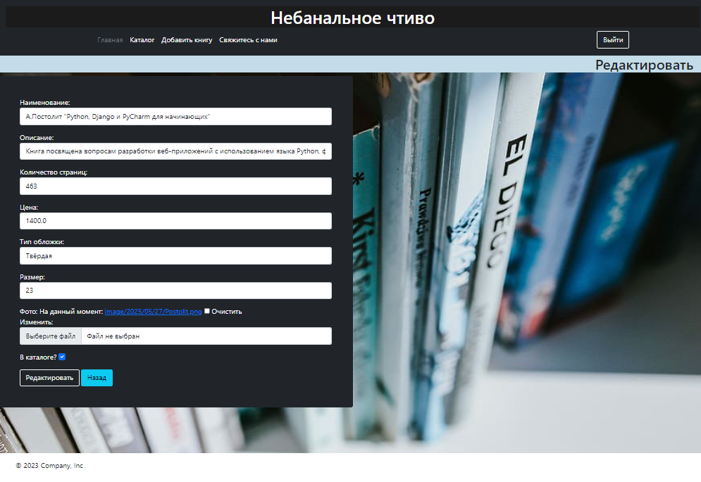
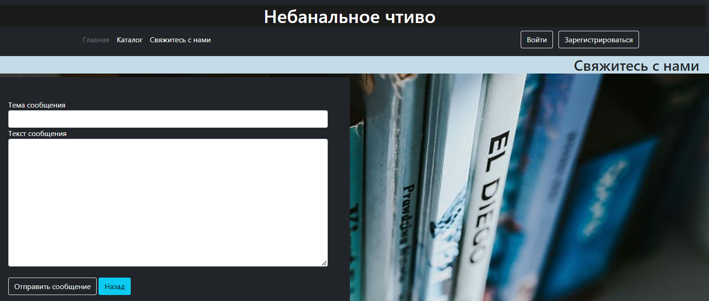

# Library: Initial Django Experience Project 2023
### Description

### Quick start via Docker

```bash
git clone https://github.com/yourusername/library_initial_django_project_2023.git
cd library_initial_django_project_2023

cp example.env .env
DEBUG=True
SECRET_KEY=your-secret-key
POSTGRES_DB=library
POSTGRES_USER=your_user
POSTGRES_PASSWORD=your_password
DB_HOST=db
DB_PORT=5432

```bash
docker-compose up --build
docker-compose exec web python manage.py migrate
docker-compose exec web python manage.py createsuperuser

Enjoy!










